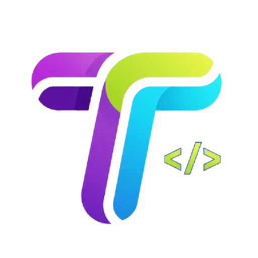

# TinkerPad

A modern JavaScript playground built with Electron, featuring a Monaco Editor, live console output, and external library support.



## Features

- **Monaco Editor** - VS Code's editor with syntax highlighting, IntelliSense, and keyboard shortcuts
- **Live Console** - Real-time console output with colored log levels and timestamps
- **External Libraries** - Add CDN libraries from trusted sources (cdnjs, unpkg, jsdelivr, etc.)
- **Playground Management** - Save, load, and organize multiple code snippets
- **Resizable Panels** - Drag to resize sidebar and console panels
- **Collapsible UI** - Hide/show panels to maximize coding space
- **Frameless Design** - Native macOS traffic lights with custom title bar
- **Keyboard Shortcuts** - Ctrl/Cmd+Enter to run, Ctrl/Cmd+S to save

## Installation

### Prerequisites

- Node.js (v16 or higher)
- npm or yarn

### Development Setup

1. Clone the repository:
```bash
git clone https://github.com/dohji/tinkerpad.git
cd tinkerpad
npm install
npm start
# For current platform
npm run build

# For specific platforms
npm run build:mac
npm run build:win
npm run build:linux
```

## Basic Operations
- New Playground: Click “New” or Ctrl/Cmd+N
- Save Playground: Click “Save” or Ctrl/Cmd+S
- Run Code: Click “Run” or Ctrl/Cmd+Enter
- Clear Console: Click “Clear” in console panel

## Architecture - Tech Stack
- Electron - Cross-platform desktop framework
- Monaco Editor - VS Code editor component
- Tailwind CSS - Utility-first CSS framework
- Webpack - Module bundler
- Node.js - JavaScript runtime for main process

## Contributions
Contributions are welcome! Please open an issue or submit a pull request for feature requests, bug fixes, or improvements.

## License
This project is licensed under the MIT License.